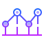

# FOMO (Fear of Missing Out) 

Simulate a cryptocurrency portfolio built over time to see how much return on investment you have missed out on, or maybe how much loss you may have avoided! Purchases will simulate a transaction in the past, persist the data to localStorage, and compare to real-time prices to give you a live dashboard of how much money you didn't make.

Check out the app deployed on Heroku [here](http://evening-beyond-73686.herokuapp.com/) (please give it a few seconds as Heroku free dynos need to wake up).

This site is served with a Node.js-based Express server and built using React + Hooks front-end, styled with React-Bootstap.

During this project, I wanted to practice several key skills
- Utilizing an external API efficiently
- Implementing a variety of available Bootstrap components
- Elegant form validation
- State persistence across sessions using localStorage 
- Project ideation, planning, environment set up 

## Technologies

<table>
  <tr>
    <td>Framework</td>
    <td>
</td>
  </tr>
  <tr>
    <td>Deployment</td>
    <td>

</td>
  </tr>
  <tr>
    <td>Style</td>
    <td>
</td>
  </tr>
</table>

## Installation

Ensure you have node and npm installed on your machine, then follow the steps below to start up the app locally.

1. Clone the repo to a local directory using `git clone https://github.com/daniel-he-dev/fomo.git`.
2. Install dependencies using `npm install`.
3. Run the app with `npm start`, and you may now access the app at `http://localhost:3001` in the browser.

## Team Members

- [Daniel He](https://github.com/daniel-he-dev)

## Roadmap

This was a learning project and will stay in maintenance mode. Feel free to [follow me on Github](https://github.com/daniel-he-dev) to stay up to date on my latest work!

## License

MIT License

